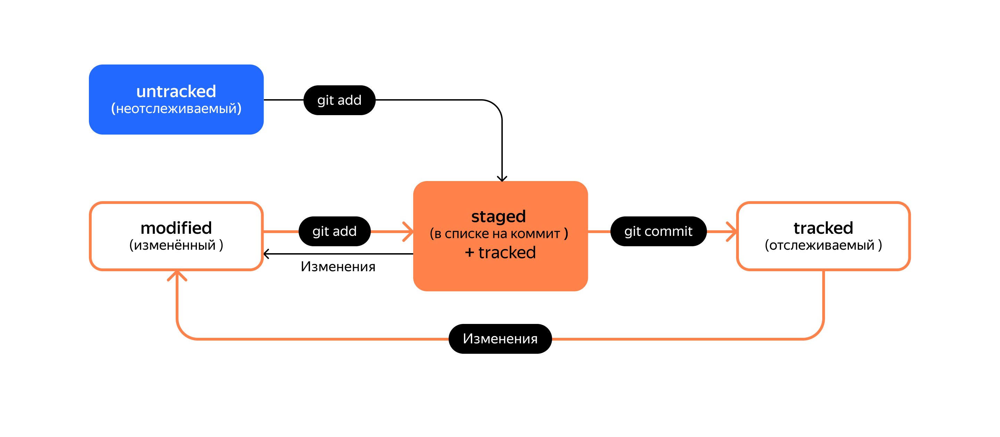

# <center> Tutorial for Git and GitHub <center>
Author: Maxim Vasilyev

Contents:

1. Info
2. Command line
   1. Installation
   2. Lauch
   3. Main commands
3. Usage
   1. Config
   2. Init
   3. Actions
4. GitHub
   1. Registration
   2. Create repo
   3. SSH keys
   4. Connect local and remote repos
   5. Synchronization
   6. Navigation
      1. Hash
      2. Log
      3. HEAD
      4. File status
5. Project structure
   1. README.md
   2. Commits commenting

## 1. Info
- Git is a program used for version control.
  - VCS - Version Control System
  - SCM - Source Control Management
- GitHub is a platform where developers store their projects.

## 2. Command line
### 1. Installation 
> ⚠ macOS/Linux users already have Git installed, so they skip this part.

Windows users need to instal `Git Bash`:

1. Visit Git [official website](https://git-scm.com/download/win "Git").
2. Download suitable `Standalone installer`.
3. Launch installer.
4. Make sure to check `Git Bash Here` option.
5. Walk through the installer and click `Finish`.

### 2. Launch
To lauch a terminal or `CLI` (Command Line Interface) you need to do:

> macOS users press `Cmd+Space` and type `Terminal`
>
> Linux users press `Ctrl+Alt+T`
>
> Windows users press `Win+S` and type `Git Bash`

### 3. Main commands
- `/` - root directory
- `~` - home directory
- `.` - current directory
- `..` - parent directory
- `⭥` - to scroll commands from buffer
- `Tab` - to autocomplete command
- `pwd` - print working directory
- `cd` - change directory
- `ls` - list directory contents
  - `-a` - display hidden content
  - `-l` - display as list
- `touch` - create file
- `mkdir` - make directory
  - `-p` - make nested directories
- `cp` - copy file(s) to somewhere
- `pbcopy` - copy data into buffer
- `mv` - move file(s) to somewhere
- `cat` - concatenate and print (only text files)
- `rm` - remove file
  - `-r` - recursively remove all items inside directory
  - `-f` - force to remove
- `rmdir` - remove directory
- `&&` - execute several commands

## 3. Usage
### 1. Config
To check whether git is correctly installed in terminal type

```bash
git version
```

To set your name and email and store this information in `.gitconfig` file run these commands:

```bash
git config --global user.name "yourName"
git config --global user.email yourEmail
```

To check config contents type

```bash
git config --list
```

### 2. Init
To keep tracking versions of project or files you need first to initialize `Git-repository`. To do this you need to:
- `cd` into neccessary directory
- type `git init`

Well done! All git-related info will be stored in `.git` hidden directory.

To remove all git info you just need to delete `.git` directory. You can do it using this command:
```bash
rm -rf .git
```

### 3. Actions
To show information about current states of files in repository type
```bash
git status
```

To prepare file(s) for saving type
```bash
git add
```
with name(s) of file(s).

To prepare all files you can type
```bash
git add --all
```
or
```bash
git add .
```

To commit changes type
```bash
git commit -m "your comments"
```
`-m` flag enables adding comments to commit.

To view commit history type
```bash
git log
```

## 4. GitHub
### 1. Registration
1. Click `Sign up` button on GitHun [main page](https://github.com/ "GitHub").
2. Fill in the required information.
3. Solve **captcha**.
4. Press `Create account`.
5. Enter code sent to yout email.

### 2. Create repo
1. Go to `Your profile` page.
2. Move to `Repositories` folder and press `New`.
3. Fill in required info and press `Create repository`.

### 3. SSH keys
When computers exchange data on the network, whey follow network protocols - rules of data exchange between computers.

One of the most popular network protocols is SSH (**S**ecure **Sh**ell Protocol)

SSH uses a pair of keys:
- **private key** is stored only on your computer and should not be transferred to anyone else. It is used to decrypt data.
- **public key** is accessible to everyone and is used to encrypt data. They can be decrypted with a paired private key.

To check whether you already have SSH key or not do the following:

1. ```bash
   cd ~```
2. ```bash
   ls -la .ssh/
   ```

If this directory is empty or nonexistent then everything is OK.

To generate SSH key:
1. Type
    ```bash
    ssh-keygen -t ed25519 -C "email linked to your GitHub account"
    ```

    In case of error type

    ```bash
    ssh-keygen -t rsa -b 4096 -C "email linked to your GitHub account"
    ```

2. Select place to store SSH key (default is home directory `~`)
3. *(optional)* Enter a passphrase if you want
4. Check keys by typing
   ```bash
   ls -a ~/.ssh 
   ```
   You should see two keys:
    - public with `.pub`
    - private

To link SSH key to your GitHub account:

1. Copy public key into buffer
   
   masOS:
   ```bash
   pbcopy < ~/.ssh/id_ed25519.pub
   ```
   Windows:
   ```bash
   clip < ~/.ssh/id_ed25519.pub
   ```
2. Go to GitHub `Settings`
3. Press `SSH and GPG keys`
4. Press `New SSH key`
5. Fill in the form and press `Add SSH key`
6. Check correctness of key by typing
   ```bash
   ssh -T git@github.com
   ```
   You can go to [this page](https://docs.github.com/en/authentication/keeping-your-account-and-data-secure/githubs-ssh-key-fingerprints) to check SHA256 key. If the key is correct type `yes`

### 4. Connect local and remote repos
1. Go to your repo on GitHub and copy `SSH URL`.
2. Open local repository and type
   ```bash
   git remote add origin pasteSSHURLhere
   ```
3. Check that repositories are connected
   ```bash
   git remote -v
   ```
   You should see two identical lines of code. `-v` is the short form of `--verbose`.

### 5. Syncronization
There may be several branches in the repository at once — parallel change histories. They can also connect to each other.

When you send changes to remote repo for the first time you need to type
```bash
git push -u origin main
```
Next time you can omit `-u` flag and use just
```bash
git push
```
Now you can see all commits on GitHub by pressing `commits` button in the top right corner.

### 6. Navigation
#### 1. Hash
Hash is the commit **ID**entifier. It is printed right after `commit` word:


Git converts commit information using the SHA-1 algorithm and calculates a unique hash identifier for each of them.

Hash is the main identifier of the commit and allows you to find out its author, date and contents of the committed files.

All hashes, as well as the *correspondences table* `hash → commit` information Git stores in the folder `.git`.

#### 2. Log
```bash
git log
```
prints commits. Each of them consists of
- hash
- author
- date
- comment

You can get short log by typing
```bash
git log --oneline
```
It will contain short hash (its length is calculated the way to be unique in the particular git repository) and comment.

#### 3. HEAD
`HEAD` is a file in `.git` directory. It points to the latest commit. Technically `HEAD` file contains link to the latest commit.

You can use `HEAD` instead of latest commit hash.

#### 4. File status
File can be in one or two statuses from the list:
- `untracked`: Git knows about the file but doesn't track it.
- `staged`: Git places the file in *staging area* after `git add` command. The file is now prepared to be commited.
- `tracked`: Git has already tracked the file.
- `modified`: Git spotted some changes while comparing the latest version of the file and the current one.


## 5. Project structure
### 1. README.md
In **README.md** file developers always store the following info:
- The name of the project and its brief description: authors, goals and problems that are being solved.
- Technologies that are used in the project. What is its difference from similar ones.
- Project documentation — detailed instructions on what the project is.
- Project plans, if any.

README.md file is written in `markdown` markup language.

Basic usage can be studied [here](https://www.markdownguide.org/ "markdown guide").

### 2. Commits commenting
```bash
git log --oneline
```
shows max 72 characters comment. That is why it it important to structure comments correctrly according to the rules:
- [corporate style](https://www.conventionalcommits.org/ru/v1.0.0-beta.4/#%D1%81%D0%BF%D0%B5%D1%86%D0%B8%D1%84%D0%B8%D0%BA%D0%B0%D1%86%D0%B8%D1%8F)
- [GitHub style](https://gist.github.com/robertpainsi/b632364184e70900af4ab688decf6f53)